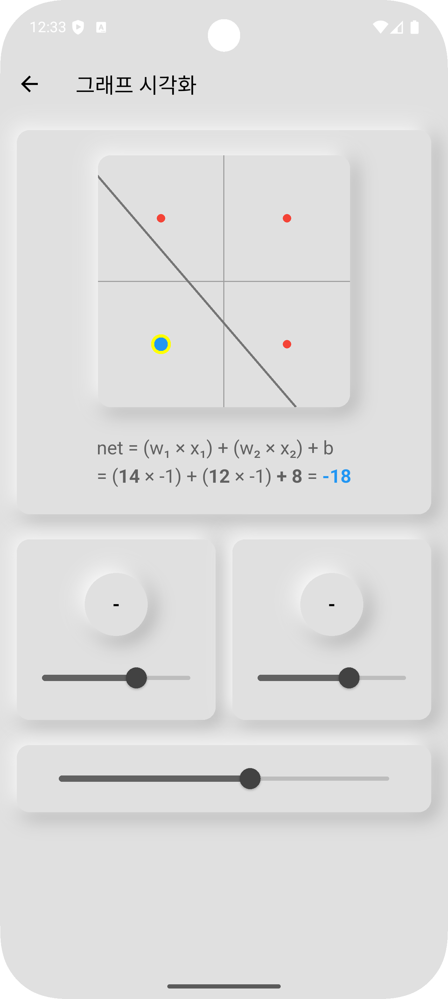

# Single Perceptron Visualizer

### Overview

**Single Perceptron Visualizer**는 Frank Rosenblatt의 초기 인공 신경망 모델인 **Perceptron**의 작동 원리를 시각적으로 학습할 수 있는 상호작용형 시뮬레이터입니다.

|                               그래프 시각화                               |
|:-------------------------------------------------------------------:|
|  |
